<div align="center">


# Mr.Enginero

**PC hardware & gaming gear for Egypt — every product shows its original price, so the discount is something you can check.**

[](https://angular.dev)
[](https://nodejs.org)
[](https://expressjs.com)
[](https://www.mongodb.com/atlas)


</div>

---

A working storefront, not a mock-up. 150 real products with real Egyptian prices, cash-on-delivery
checkout that reserves stock atomically, order email to the manager, and an admin dashboard for
orders, catalogue, users and settings.

<div align="center">
  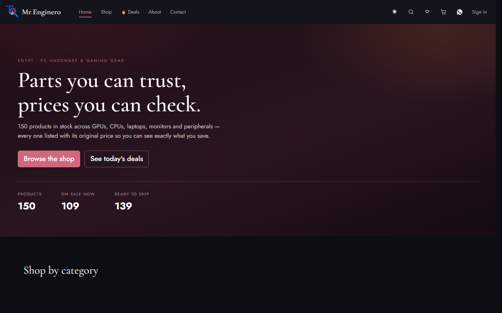
</div>

---

## Table of contents

- [What it does](#what-it-does) · [Screens](#screens) · [Quick start](#quick-start)
- [Configuration](#configuration) · [Google sign-in](#google-sign-in) · [Order email](#order-email)
- [The catalogue](#the-catalogue) · [Selling](#selling-cash-on-delivery) · [API](#api)
- [Architecture](#architecture) · [Security](#security) · [Performance](#performance)
- [Scripts](#scripts) · [Docs](#further-reading) · [Known limitations](#known-limitations)

---

## What it does

| For shoppers | For the owner |
| --- | --- |
| Browse 150 products across 11 categories | Orders board with one-tap call / WhatsApp |
| Search, filter by brand, price, stock and sale | Confirm → prepare → ship → deliver, with email at each step |
| Original price + saving shown on every card | Cancel returns every unit to stock |
| Cart that survives closing the tab | Full catalogue CRUD with a live card preview |
| Cash-on-delivery checkout, no card needed | See which shop each price came from, and whether it drifted |
| Printable receipt with a progress tracker | Manage accounts: roles, verification, removal |
| Google sign-in, or email + password | Change delivery fees and pause orders without a redeploy |
| Dark and light themes | Setup checklist that flags anything unconfigured |

---

## Screens

<table>
<tr>
<td width="50%">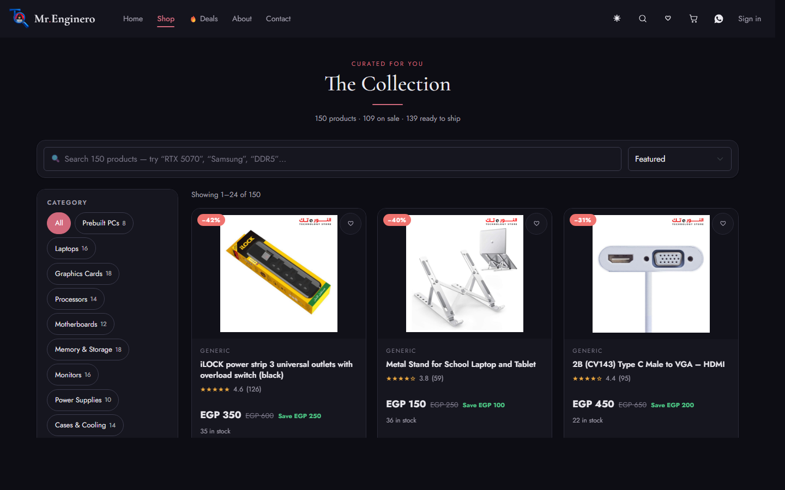<br><em align="center">Shop — server-side search, facets, pagination</em></td>
<td width="50%">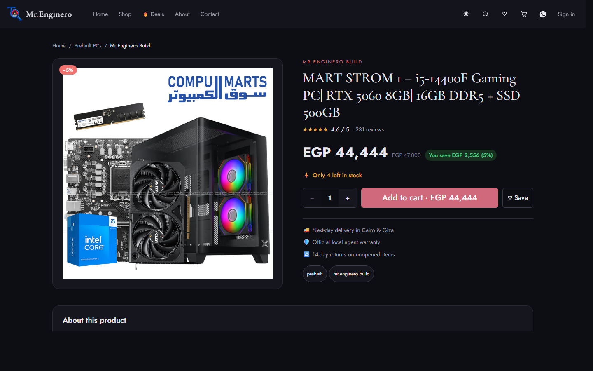<br><em>Product — gallery, savings, spec list</em></td>
</tr>
<tr>
<td>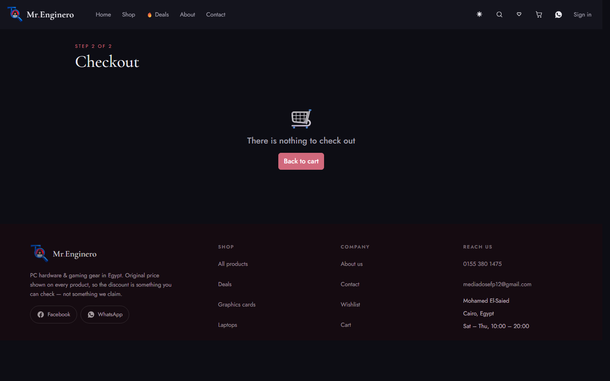<br><em>Checkout — cash on delivery</em></td>
<td>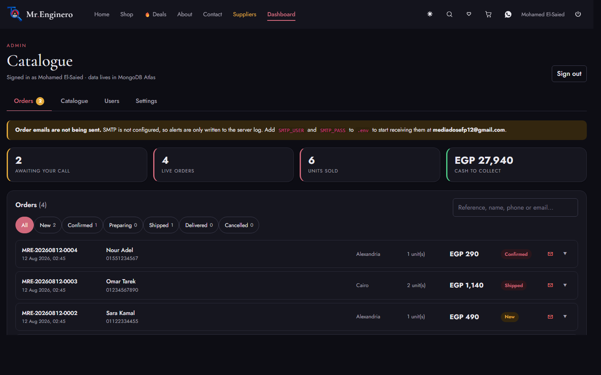<br><em>Admin — orders board</em></td>
</tr>
<tr>
<td>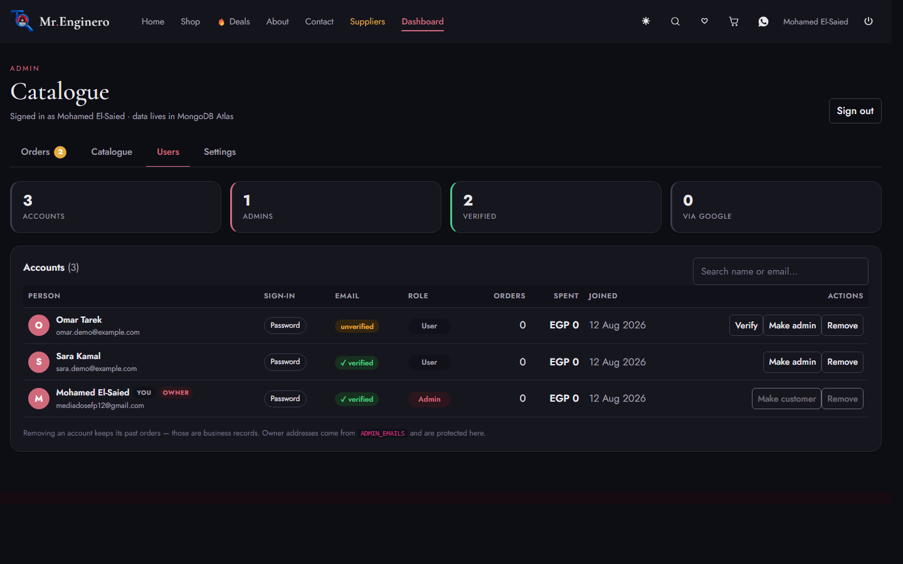<br><em>Admin — user management</em></td>
<td>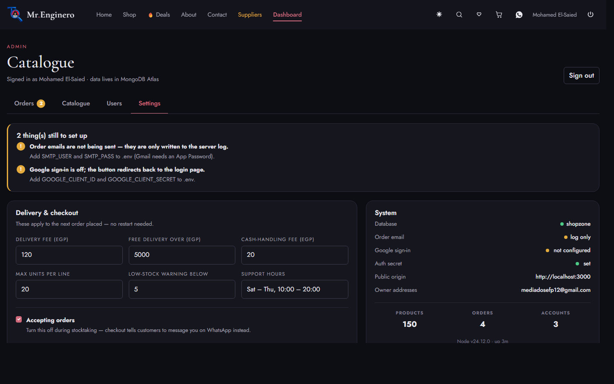<br><em>Admin — settings & system status</em></td>
</tr>
</table>

<details>
<summary><b>Mobile & dark theme</b></summary>
<br>
<table>
<tr>
<td width="25%">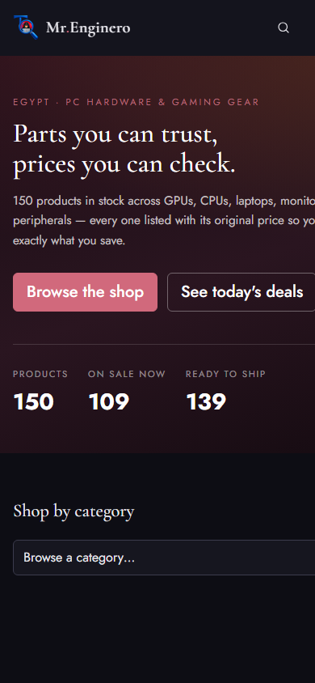<br><em>Home</em></td>
<td width="25%">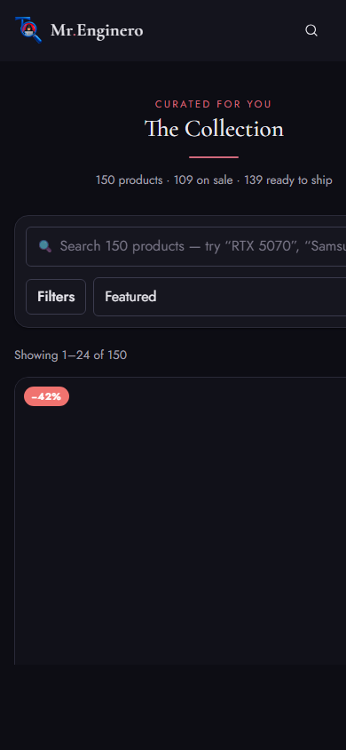<br><em>Shop</em></td>
<td width="25%">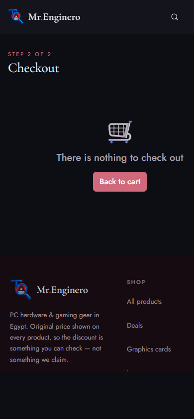<br><em>Checkout</em></td>
<td width="25%">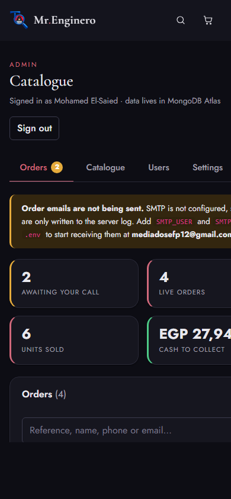<br><em>Dashboard</em></td>
</tr>
</table>
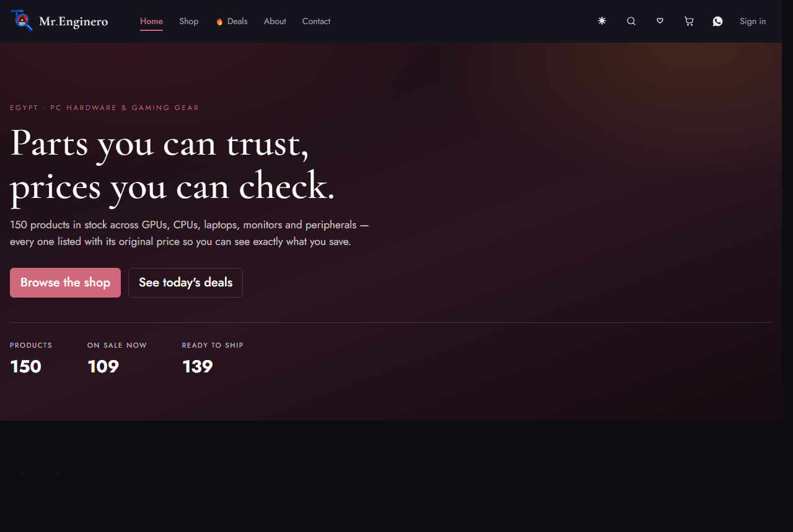
</details>

---

## Quick start

**Prerequisites** — Node 20+, and a MongoDB connection string (Atlas free tier is fine).

```bash
git clone <your-repo-url>
cd Mr.Enginero-E-commerce-main
npm install
```

```bash
cp .env.example .env
```

Fill in at minimum `MONGODB_URI` and `ADMIN_EMAILS`, then load the catalogue:

```bash
npm run db:seed
```

```bash
npm run dev
```

`npm run dev` runs both processes — the API on **:3000** and the Angular dev server on **:4200**,
which proxies `/api` through. Open <http://localhost:4200>.

For a production-style single process serving the built app *and* the API:

```bash
npm run build && npm run serve:prod
```

### Becoming the admin

There are **no seeded accounts**. Register at `/register` with an address listed in `ADMIN_EMAILS`
— or sign in with that Google account — and it becomes an admin on first sign-in. Any other address
is a normal customer.

---

## Configuration

Everything lives in `.env` (gitignored; `.env.example` documents it).

| Variable | Required | What it does |
| --- | :---: | --- |
| `MONGODB_URI` | ✅ | Atlas connection string |
| `MONGODB_DB` | | Database name, defaults to `shopzone` |
| `ADMIN_EMAILS` | ✅ | Comma-separated. These addresses become admins on first sign-in |
| `AUTH_SECRET` | ✅ | Signs session tokens. **Must** be long and random — the server refuses to call a placeholder configured |
| `PUBLIC_ORIGIN` | | Your real origin. Used for verification links and the OAuth redirect |
| `API_PORT` | | Defaults to 3000 |
| `GOOGLE_CLIENT_ID` / `GOOGLE_CLIENT_SECRET` | | Enables Google sign-in. Blank = password only |
| `SMTP_HOST` / `SMTP_PORT` / `SMTP_USER` / `SMTP_PASS` | | Order email. Blank = messages logged, not sent |
| `SMTP_FROM` | | Sender name and address |
| `ORDERS_EMAIL_TO` | | Where new-order alerts land |

Generate a secret:

```bash
node -e "console.log(require('crypto').randomBytes(48).toString('base64url'))"
```

The dashboard's **Settings** tab shows a live checklist of anything still unconfigured, so you never
have to guess whether email or SSO is actually working.

### Google sign-in

1. [console.cloud.google.com](https://console.cloud.google.com) → create a project
2. **APIs & Services → OAuth consent screen** → External → add your address under **Test users**
3. **Credentials → Create credentials → OAuth client ID → Web application**
4. Authorised redirect URI — copy it **exactly** from the server's boot log:
   ```
   http://localhost:3000/api/auth/google/callback
   ```
5. Put the client ID and secret in `.env` and **restart** — `.env` is read once at boot

> **Watch out:** the redirect URI is pinned to `PUBLIC_ORIGIN`, not to whatever port you happen to
> browse. Without that pinning, using `npm run dev` on :4200 sends Google a URI you never registered
> and sign-in fails with `redirect_uri_mismatch`.

### Order email

Gmail needs an **App Password**, not your account password: enable 2-Step Verification, then
Google Account → Security → App passwords, and paste the 16-character code as `SMTP_PASS`.

| Email | To | When |
| --- | --- | --- |
| New-order alert | `ORDERS_EMAIL_TO` | an order is placed |
| Order confirmation | the customer | an order is placed |
| Status update | the customer | confirmed / preparing / shipped / delivered / cancelled |
| Verify your email | the customer | registration |
| Manual message | the customer | you write one from the dashboard |

**With no SMTP the store still works.** Messages go to the server console, the dashboard shows an
amber banner, and the outcome of every attempt is recorded on the order — a mail outage is visible,
never silent. The receipt only claims an email was sent when one actually left.

---

## The catalogue

150 products built by `npm run catalog:build` from five Egyptian retailers' public storefront feeds
(Shopify and WooCommerce), **three of them Alexandria businesses**.

| Supplier | City | Products |
| --- | --- | ---: |
| CompuMarts | Alexandria | 33 |
| UpToDate Tech | Alexandria | 32 |
| El Hamd Computer Supplies | Alexandria | 26 |
| Elyamama Store | Cairo | 31 |
| El Nour Tech | Cairo | 28 |
| Sigma Computer | Alexandria | — *(no public feed; listed in the directory only)* |

**61% of the catalogue comes from Alexandria shops.** 109 of the 150 carry a genuine discount —
`originalPrice` is the retailer's own compare-at price and `discount` is derived from the two, never
invented.

| Real, from the retailer | Generated for the demo |
| --- | --- |
| Name, brand, selling price, original price | Unit stock counts |
| Photography, marketing copy, availability | Star ratings and review counts |

> **Sourcing is admin-only.** Which shop a product came from, what it cost there, and the supplier
> directory are stripped from every public response — including out of the searchable text, so
> searching a shop's name cannot reveal which products come from it.

---

## Selling: cash on delivery

1. **Checkout** takes the recipient, an Egyptian mobile (`010/011/012/015` + 8 digits), an optional
   email and a governorate/city/street address.
2. **The server prices the order.** Prices sent by the browser are ignored — every line is re-read
   from the database and the totals recomputed.
3. **Stock is reserved atomically.** Each line decrements under a `quantity >= n` guard, so two
   shoppers racing for the last unit cannot both win. If any line fails, the rest are released.
4. **A reference is issued** — `MRE-20260811-0001`, readable over the phone.
5. **Emails go out**, and the customer lands on a printable receipt at `/order/:ref`.

`pending → confirmed → preparing → shipped → delivered`, with `cancelled` reachable from any live
state. **Cancelling returns every unit to stock**; delivering marks it paid. A second cancel is
rejected, so stock is never restored twice. Fees are editable in **Settings** and apply immediately.

---

## API

<details>
<summary><b>Full endpoint list</b></summary>

### Products
| Method | Endpoint | Notes |
| --- | --- | --- |
| `GET` | `/api/products` | `q`, `categoryId`, `brand`, `minPrice`, `maxPrice`, `inStock`, `onSale`, `sort`, `page`, `limit` |
| `GET` | `/api/products/facets` | category counts, brands, price range, totals |
| `GET` | `/api/products/stats` | dashboard KPIs |
| `GET` | `/api/products/:id` | product + 4 related |
| `POST` `PUT` `DELETE` | `/api/products[/:id]` | **admin** |
| `PATCH` | `/api/products/:id/stock` | atomic `{ delta }`, refuses to oversell (409) |

### Orders
| Method | Endpoint | Notes |
| --- | --- | --- |
| `GET` | `/api/checkout/config` | governorates and live fees |
| `POST` | `/api/orders` | place an order — guests allowed |
| `GET` | `/api/orders` | **admin** list, filter + search + pagination |
| `GET` | `/api/orders/:ref` | receipt by reference; admins get the full record |
| `PATCH` | `/api/orders/:ref/status` | **admin** |
| `POST` | `/api/orders/:ref/contact` | **admin** — email the customer or log a call |

### Auth & admin
| Method | Endpoint | Notes |
| --- | --- | --- |
| `POST` | `/api/auth/register` \| `/login` | returns `{ user, token }` |
| `GET` | `/api/auth/google` \| `/google/callback` | OAuth 2.0 |
| `GET` | `/api/auth/verify` | email confirmation link |
| `GET` | `/api/auth/me` \| `/providers` | session, enabled sign-in methods |
| `GET` `PATCH` `DELETE` | `/api/admin/users[/:id]` | **admin** — roles, verification, removal |
| `GET` `PUT` | `/api/admin/settings` | **admin** — fees plus live system status |
| `GET` | `/api/suppliers` | **admin** — supplier directory |
| `GET` | `/api/health` | pings MongoDB |

</details>

Listing, facets and stats are each answered by a single `$facet` aggregation — one round-trip per
page rather than one per widget. Whatever the sort, in-stock products come first.

---

## Architecture

```
server/                     Express API (plain ESM, no build step)
├── index.mjs               wiring, compression, static SPA, graceful shutdown
├── db.mjs                  pooled MongoClient + index management
├── auth.mjs                scrypt hashing, signed tokens, weak-secret detection
├── google-oauth.mjs        OAuth 2.0 against Google directly
├── mailer.mjs              SMTP with a log fallback, HTML templates
├── settings.mjs            editable store settings, cached
└── routes/                 products · orders · auth · admin · suppliers

scripts/
├── sources.mjs             retailer feed adapters (Shopify + WooCommerce)
├── build-catalog.mjs       → data/products.seed.json
├── seed-db.mjs             upsert catalogue, grant admin, purge demo data
├── make-icons.mjs          favicons cut from public/logo.png
└── capture-screens.mjs     the screenshots in this README

src/app/
├── Components/             header footer home shop product-card product-details
│                           cart checkout order-confirmation wishlist deals
│                           stores dashboard(orders|catalogue|users|settings)
│                           about contact login register auth-callback shared
├── services/               product auth cart wishlist order admin theme toast
├── interceptors/           bearer-token attachment
├── brand.ts                one source of truth for name, phone, socials
└── Models/                 IProduct · IOrder · IFacets · admin types
```

**Design tokens.** Every colour, radius, shadow and duration is a CSS custom property in
`src/styles.css`. Dark mode swaps token values on `:root[data-theme="dark"]` — no `!important`
overrides — and an inline script applies the stored theme before the bundle loads, so there is no
white flash.

---

## Security

- `.env` is gitignored; `.env.example` documents every variable.
- Passwords are salted **scrypt** hashes compared in constant time.
- Session tokens are HMAC-signed and expire after 7 days. A placeholder or short `AUTH_SECRET` is
  rejected by the health checks and warned about at boot.
- `role` is never read from a request body — nobody can register as an admin.
- **Order prices are computed server-side**; a tampered cart cannot change what a customer is charged.
- Stock decrements are guarded, so the store cannot oversell under concurrent checkouts.
- OAuth state is HMAC-signed with a TTL (CSRF protection without server-side session storage), and
  the token comes back in the URL **fragment**, never the query string.
- Google's `email_verified` is honoured — an unverified address cannot claim an existing account.
- Admin responses are `Cache-Control: private` with `Vary: Authorization`, so a shared cache can
  never hand a shopper an admin's copy.
- Self-demotion, self-deletion and removing the last admin are all refused.

> **Before deploying:** set a real `AUTH_SECRET`, set `PUBLIC_ORIGIN`, and rotate any credential
> that has ever been shared.

---

## Performance

- Search, filter, sort and pagination run in MongoDB — the browser holds 24 products, not 150.
- Debounced input: 300 ms on shop search, 250 ms in the header.
- `OnPush` + signals throughout; a grid re-renders only what changed.
- Lazy routes. **Initial bundle ~344 kB raw / ~98 kB gzipped.**
- Images lazy-loaded and async-decoded below the fold, eager with `fetchpriority="high"` above it,
  every one with explicit dimensions so nothing shifts.
- `Cache-Control` on list (30 s), detail (60 s) and facets (5 min); hashed assets immutable for a
  year while `index.html` is never cached.
- gzip on every API response; no Bootstrap JS; a CSS-only hero instead of a carousel.

**Mobile:** audited across 12 pages at 375 / 768 / 1280 px — zero horizontal overflow and zero tap
targets under 40 px. See the [audit report](docs/AUDIT-REPORT.md).

---

## Scripts

| Script | What it does |
| --- | --- |
| `npm run dev` | API + Angular dev server together |
| `npm start` | Angular dev server only |
| `npm run serve:api` | API only, with `--watch` |
| `npm run build` | production build into `dist/shopzone` |
| `npm run serve:prod` | one process serving the built SPA and the API |
| `npm run db:seed` | upsert the catalogue, grant admin, purge demo data |
| `npm run db:reset` | same, but clears products first |
| `npm run catalog:build` | rebuild `data/products.seed.json` from the live feeds |
| `npm run icons` | regenerate favicons from `public/logo.png` |
| `npm run screens` | recapture the screenshots in `docs/screens` |
| `npm run report` | rebuild `docs/audit-report.html` |

---

## Further reading

- **[Deployment guide](docs/DEPLOYMENT.md)** — taking it live, step by step, with a troubleshooting table
- **[Project structure](docs/PROJECT-STRUCTURE.md)** — languages, every folder, and where to change what
- **[Technical & UX audit report](docs/AUDIT-REPORT.md)** — findings, fixes, before/after evidence
- **[Demo walkthroughs](docs/DEMO-WALKTHROUGHS.md)** — customer and admin journeys, step by step
- **[Illustrated report](docs/audit-report.html)** — the same audit with screenshots embedded

---

## Known limitations

Stated plainly rather than left to discover:

- **Sigma Computer** publishes no machine-readable catalogue, so none of its stock is listed. It
  appears in the supplier directory with that status shown.
- **Stock counts, ratings and review counts are generated** — no storefront feed exposes them.
  Everything else in the catalogue is real.
- **Prices are a snapshot** from when the catalogue was built. Re-run `npm run catalog:build`
  followed by `npm run db:seed` to refresh; the dashboard flags any product whose price has drifted
  from the captured one.
- **Checkout does not take payment** — it is cash on delivery by design.
- **No automated test suite yet.** Verification so far has been manual and scripted against the
  running API.

---

<div align="center">

Built by **Mohamed El-Saied** · Cairo, Egypt

[Facebook](https://www.facebook.com/profile.php?id=100064741230093) · [WhatsApp](https://wa.me/201553801475)

<sub>Product data and photography belong to their respective retailers.</sub>

</div>
